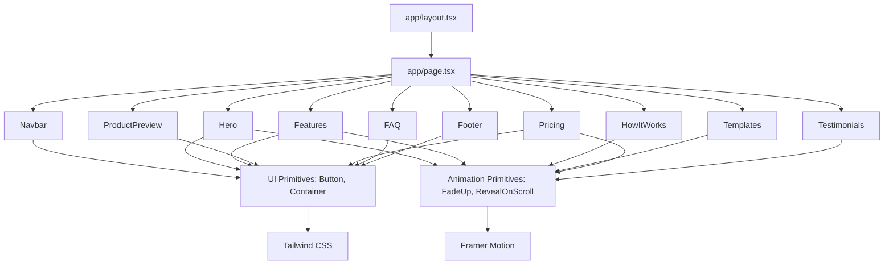
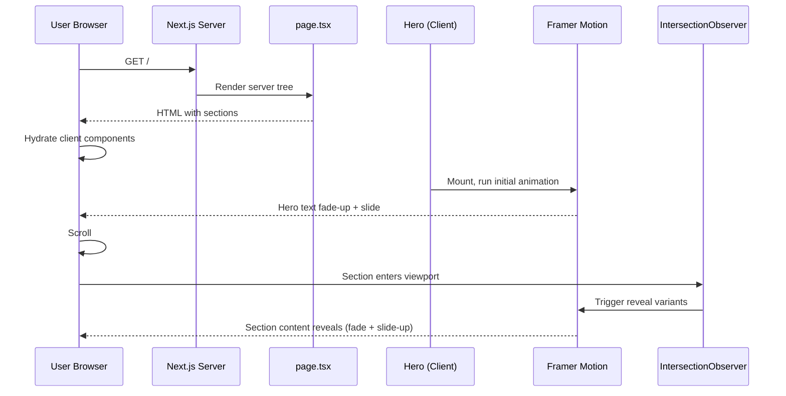
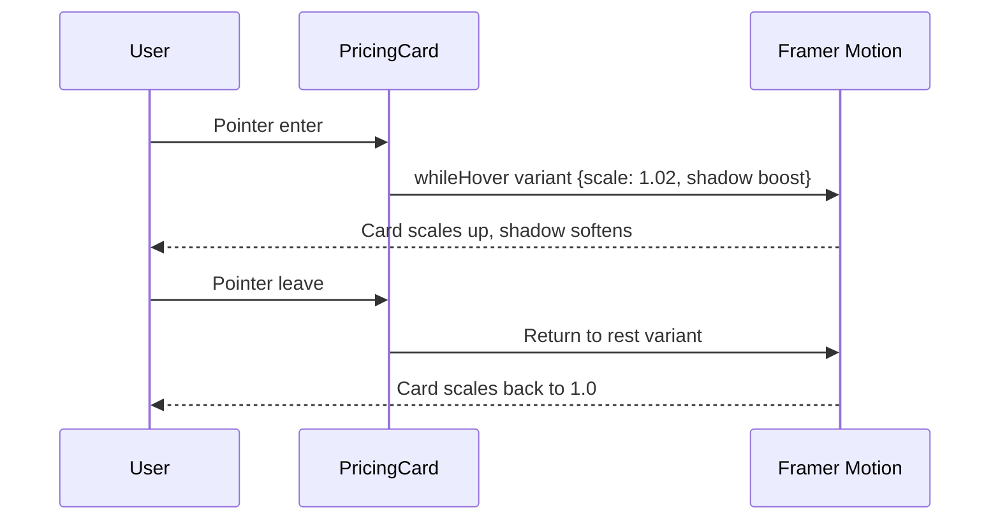
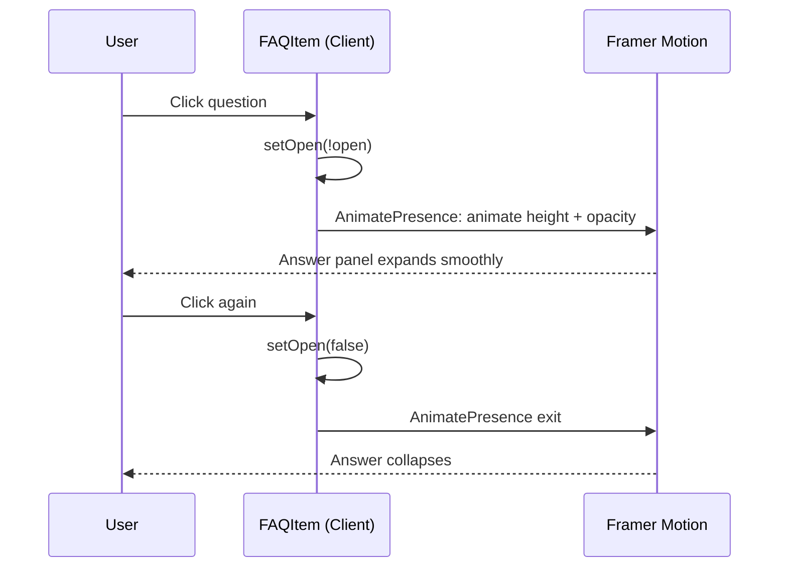

# Design Document: Altask Landing Page

## Overview

Altask is a modern drag-and-drop website builder marketed through a single-page marketing site. This design defines a production-ready Next.js (App Router) landing page styled with Tailwind CSS and animated with Framer Motion. The page is composed of ten distinct sections (Navbar, Hero, Features, How It Works, Templates, Product Preview, Pricing, Testimonials, FAQ, Footer), each implemented as a self-contained, reusable React Server/Client component.

The aesthetic targets a minimalistic, premium SaaS feel inspired by Linear, Vercel, and Framer: subtle dark and light gradient backgrounds, generous whitespace, 2xl rounded cards, soft shadows, and smooth motion (fade, slide, scale). The architecture favors a clean separation between layout primitives (`Section`, `Container`), UI primitives (`Button`, `Card`, `Badge`), animation primitives (`FadeUp`, `RevealOnScroll`, `HoverScale`), and feature sections (one component per landing-page section). The site is fully static, frontend-only, and optimized for fast load and smooth scroll-based animations.

This document is implementation-ready: it specifies the architecture, component interfaces, data models, content structure, motion variants, and correctness properties that govern rendering and interaction behavior.

## Architecture

### High-Level Architecture



### Folder Structure

```
app/
  layout.tsx              # Root layout, fonts, metadata, theme provider
  page.tsx                # Landing page composition
  globals.css             # Tailwind base + design tokens
components/
  layout/
    Navbar.tsx
    Footer.tsx
  sections/
    Hero.tsx
    Features.tsx
    HowItWorks.tsx
    Templates.tsx
    ProductPreview.tsx
    Pricing.tsx
    Testimonials.tsx
    FAQ.tsx
  ui/
    Button.tsx
    Card.tsx
    Badge.tsx
    Container.tsx
    Section.tsx
  motion/
    FadeUp.tsx
    RevealOnScroll.tsx
    HoverScale.tsx
    motionVariants.ts
  icons/
    index.tsx             # Icon barrel (lucide-react re-exports)
lib/
  content.ts              # Static content (features, templates, pricing, testimonials, faqs, nav links)
  cn.ts                   # className merge helper
  types.ts                # Shared TypeScript types
public/
  images/                 # Avatars, template thumbs, OG image
tailwind.config.ts
next.config.mjs
```

### Rendering & Component Strategy

- The root `app/page.tsx` is a Server Component that imports and composes section components in order.
- Section components that contain Framer Motion animations or interactive state (Navbar, Hero, Features, HowItWorks, Templates, ProductPreview, Pricing, Testimonials, FAQ) are Client Components (`"use client"`).
- Footer and pure-content sections without motion can be Server Components.
- Static content lives in `lib/content.ts` so sections receive props or import typed data, keeping components rendering-only.
- Mobile-first responsive design uses Tailwind breakpoints: base (mobile), `sm` (640px), `md` (768px), `lg` (1024px), `xl` (1280px).

### Theming & Design Tokens

Design tokens are defined in `tailwind.config.ts` and consumed via Tailwind utilities:

- **Colors**: neutral scale for backgrounds/text, a single brand accent (indigo/violet) for CTAs and highlights, semantic surface tokens.
- **Radius**: `rounded-2xl` (16px) is the default card radius; `rounded-full` for pills/avatars.
- **Shadows**: `shadow-soft` (custom: large blur, low opacity) for cards; `shadow-glow` for the highlighted Pro pricing card.
- **Gradients**: subtle radial/linear gradients on Hero and section backgrounds.
- **Typography**: `Inter` (or `Geist`) variable font from `next/font/google`.
- **Dark mode**: class-based (`dark:` prefix). Both light and dark surfaces use subtle gradient backgrounds.

## Sequence Diagrams

### Page Load Animation Sequence



### Pricing Card Hover Interaction



### FAQ Accordion Expand



## Components and Interfaces

All components are written in TypeScript. Section components consume typed content from `lib/content.ts`. Props are minimal because sections are largely composition-driven.

### UI Primitives

#### `Button`

**Purpose**: Reusable CTA button with variants and sizes.

```typescript
type ButtonVariant = "primary" | "secondary" | "ghost";
type ButtonSize = "sm" | "md" | "lg";

interface ButtonProps extends React.ButtonHTMLAttributes<HTMLButtonElement> {
  variant?: ButtonVariant;
  size?: ButtonSize;
  href?: string;          // If provided, renders as <a>
  asChild?: boolean;      // For composition with other elements
  children: React.ReactNode;
}

declare function Button(props: ButtonProps): JSX.Element;
```

**Responsibilities**:
- Render `<a>` when `href` is provided, otherwise `<button>`.
- Apply variant and size classes via Tailwind.
- Include focus-visible ring for accessibility.

#### `Card`

**Purpose**: Base rounded container used by Features, Templates, Pricing, Testimonials.

```typescript
interface CardProps extends React.HTMLAttributes<HTMLDivElement> {
  highlighted?: boolean;  // Adds glow/border for emphasis (e.g., Pro plan)
  className?: string;
  children: React.ReactNode;
}
```

**Responsibilities**:
- Apply `rounded-2xl`, `shadow-soft`, padding, border, and dark-mode surfaces.
- Add `shadow-glow` and accent border when `highlighted` is true.

#### `Badge`

**Purpose**: Small pill for tags like "Most Popular" or feature labels.

```typescript
interface BadgeProps {
  children: React.ReactNode;
  variant?: "default" | "accent";
  className?: string;
}
```

#### `Container`

**Purpose**: Centered max-width wrapper with horizontal padding.

```typescript
interface ContainerProps {
  className?: string;
  children: React.ReactNode;
}
// max-w-7xl mx-auto px-4 sm:px-6 lg:px-8
```

#### `Section`

**Purpose**: Standardized vertical spacing and optional id for in-page anchors.

```typescript
interface SectionProps {
  id?: string;
  className?: string;
  children: React.ReactNode;
}
// py-20 md:py-28 lg:py-32
```

### Animation Primitives

#### `FadeUp`

**Purpose**: Fade-in + upward slide on mount, with configurable delay.

```typescript
interface FadeUpProps {
  delay?: number;           // seconds, default 0
  duration?: number;        // seconds, default 0.6
  y?: number;               // px offset, default 16
  className?: string;
  children: React.ReactNode;
  as?: keyof JSX.IntrinsicElements; // default "div"
}
```

#### `RevealOnScroll`

**Purpose**: Animate content into view when entering viewport.

```typescript
interface RevealOnScrollProps {
  delay?: number;
  duration?: number;
  y?: number;               // default 24
  amount?: number;          // viewport amount threshold, default 0.2
  once?: boolean;           // default true
  className?: string;
  children: React.ReactNode;
}
```

Implementation uses Framer Motion's `whileInView` with `viewport={{ once, amount }}`.

#### `HoverScale`

**Purpose**: Wraps children with a hover scale interaction.

```typescript
interface HoverScaleProps {
  scale?: number;            // default 1.03
  className?: string;
  children: React.ReactNode;
}
```

#### `motionVariants.ts`

Shared variants used across sections.

```typescript
export const fadeUpVariant = {
  hidden: { opacity: 0, y: 16 },
  visible: { opacity: 1, y: 0 },
};

export const staggerContainer = (stagger = 0.08, delayChildren = 0) => ({
  hidden: {},
  visible: {
    transition: { staggerChildren: stagger, delayChildren },
  },
});

export const cardHoverVariant = {
  rest: { scale: 1, transition: { duration: 0.2 } },
  hover: { scale: 1.03, transition: { duration: 0.2 } },
};
```

### Layout Components

#### `Navbar`

**Purpose**: Sticky top navigation with logo, primary links, and CTA.

```typescript
interface NavLink {
  label: string;
  href: string;
}

interface NavbarProps {
  links: NavLink[];        // From lib/content.ts
  ctaLabel: string;        // "Get Started"
  ctaHref: string;
}
```

**Responsibilities**:
- Render sticky, blurred-background navbar (`backdrop-blur` + translucent surface).
- Render logo wordmark "Altask".
- Render desktop horizontal nav and CTA button.
- Render mobile menu (hamburger) that toggles a slide-in/full-screen panel.
- Smooth-scroll to in-page anchors (e.g., `#features`, `#pricing`).

#### `Footer`

**Purpose**: Site footer with grouped links and copyright.

```typescript
interface FooterGroup {
  title: string;             // "Product", "Company", "Social"
  links: { label: string; href: string }[];
}

interface FooterProps {
  groups: FooterGroup[];
  copyright: string;         // "© 2025 Altask. All rights reserved."
}
```

### Section Components

Each section is a self-contained component. Their public surface is small (often props-less) because content is imported from `lib/content.ts`.

#### `Hero`

**Purpose**: Top-of-page headline, subtext, dual CTAs, and animated mock editor UI.

```typescript
interface HeroProps {
  headline: string;          // "Build websites visually. No code. Full control."
  subtext: string;
  primaryCta: { label: string; href: string };  // "Start Building Free"
  secondaryCta: { label: string; href: string }; // "Watch Demo"
}
```

**Responsibilities**:
- Render headline with fade-up animation on load (sequential per word or per line).
- Render subtext fading up after headline.
- Render two CTAs side-by-side (stack on mobile).
- Render a stylized mock editor preview (decorative, not interactive) with subtle floating motion.
- Use a soft radial gradient background.

#### `Features`

**Purpose**: 6-card grid of product features.

```typescript
interface Feature {
  id: string;
  title: string;             // e.g., "Drag & Drop Builder"
  description: string;
  icon: React.ComponentType<{ className?: string }>;
}

interface FeaturesProps {
  features: Feature[];       // length === 6
  heading: string;
  eyebrow?: string;
}
```

**Responsibilities**:
- Render section heading with reveal-on-scroll.
- Render responsive grid: 1 col (mobile), 2 cols (md), 3 cols (lg).
- Each card uses `Card` + `HoverScale`, with icon, title, description.
- Stagger card reveal as the section enters viewport.

#### `HowItWorks`

**Purpose**: 3-step horizontal/vertical flow.

```typescript
interface Step {
  number: number;            // 1, 2, 3
  title: string;             // "Choose Template"
  description: string;
  icon?: React.ComponentType<{ className?: string }>;
}

interface HowItWorksProps {
  steps: Step[];             // length === 3
  heading: string;
}
```

**Responsibilities**:
- Render 3 numbered steps in a row on `lg+`, stacked on smaller screens.
- Animate step numbers (count-up or simple scale-in) and connecting line on scroll.

#### `Templates`

**Purpose**: 4-template grid with hover scaling.

```typescript
interface Template {
  id: string;
  name: string;              // "Startup", "Portfolio", "SaaS", "E-commerce"
  category: string;
  thumbnail: string;         // /images/templates/...
  href: string;
}

interface TemplatesProps {
  templates: Template[];     // length === 4
  heading: string;
}
```

**Responsibilities**:
- Render responsive grid: 1 col (mobile), 2 cols (sm), 4 cols (lg).
- Each tile: `Card` containing `next/image` thumbnail; on hover, `scale-105` + soft shadow boost.

#### `ProductPreview`

**Purpose**: Decorative fake editor UI with three regions.

```typescript
interface ProductPreviewProps {
  heading: string;
  description: string;
}
```

**Responsibilities**:
- Render a stylized container shaped like an app window (top bar with traffic-light dots).
- Inside: left sidebar (component list mock), center canvas (placeholder elements), right sidebar (settings mock).
- Subtle floating animation on canvas elements.
- Fully static visual — no real editor behavior.

#### `Pricing`

**Purpose**: 3 pricing tiers; Pro is highlighted.

```typescript
interface PricingPlan {
  id: "free" | "pro" | "team";
  name: string;
  price: string;             // "$0", "$19", "$49"
  period: string;            // "/month" or ""
  description: string;
  features: string[];
  cta: { label: string; href: string };
  highlighted: boolean;      // true for "pro"
  badge?: string;            // "Most Popular" for pro
}

interface PricingProps {
  plans: PricingPlan[];      // length === 3
  heading: string;
}
```

**Responsibilities**:
- Render responsive grid: 1 col (mobile), 3 cols (lg).
- The plan with `highlighted === true` receives accent border, glow shadow, and optional `Badge`.
- Reveal-on-scroll with stagger.

#### `Testimonials`

**Purpose**: 3 customer testimonials with avatar and name.

```typescript
interface Testimonial {
  id: string;
  quote: string;
  author: string;
  role: string;              // "Founder, Acme"
  avatar: string;            // /images/avatars/...
}

interface TestimonialsProps {
  testimonials: Testimonial[];  // length === 3
  heading: string;
}
```

#### `FAQ`

**Purpose**: Accordion of common SaaS questions.

```typescript
interface FAQEntry {
  id: string;
  question: string;
  answer: string;
}

interface FAQProps {
  entries: FAQEntry[];
  heading: string;
}
```

**Responsibilities**:
- Render each entry as a clickable header with chevron icon.
- Maintain `openId: string | null` state. Clicking an open entry closes it; clicking a different entry opens it (single-open behavior).
- Use Framer Motion `AnimatePresence` for height + opacity transitions.
- Keyboard accessible: button semantics, `aria-expanded`, `aria-controls`.

## Data Models

All static content is defined in `lib/content.ts` and `lib/types.ts`. No backend or external data sources.

### `lib/types.ts`

```typescript
export interface NavLink { label: string; href: string }

export interface Feature {
  id: string;
  title: string;
  description: string;
  icon: React.ComponentType<{ className?: string }>;
}

export interface Step {
  number: number;
  title: string;
  description: string;
  icon?: React.ComponentType<{ className?: string }>;
}

export interface Template {
  id: string;
  name: string;
  category: string;
  thumbnail: string;
  href: string;
}

export interface PricingPlan {
  id: "free" | "pro" | "team";
  name: string;
  price: string;
  period: string;
  description: string;
  features: string[];
  cta: { label: string; href: string };
  highlighted: boolean;
  badge?: string;
}

export interface Testimonial {
  id: string;
  quote: string;
  author: string;
  role: string;
  avatar: string;
}

export interface FAQEntry {
  id: string;
  question: string;
  answer: string;
}

export interface FooterGroup {
  title: string;
  links: { label: string; href: string }[];
}
```

### Content Validation Rules

- `navLinks` MUST contain exactly the 6 entries: Product, Features, Templates, Pricing, Docs, Blog.
- `features` array MUST have length 6.
- `steps` array MUST have length 3 with `number` values 1, 2, 3 in order.
- `templates` array MUST have length 4 with names: Startup, Portfolio, SaaS, E-commerce.
- `pricingPlans` array MUST have length 3 with ids `free`, `pro`, `team`. Exactly one plan MUST have `highlighted: true` (the `pro` plan).
- `testimonials` array MUST have length 3.
- `faqEntries` MUST cover the four required topics: coding required, export, hosting, free plan.
- All `href` values MUST be either in-page anchors (`#section`) or absolute URLs starting with `/` or `https://`.
- All image paths MUST resolve under `/public`.

## Algorithmic Pseudocode

### Page Composition

```pascal
ALGORITHM renderLandingPage()
INPUT: none (static content from lib/content.ts)
OUTPUT: rendered React tree

BEGIN
  ASSERT content.navLinks.length = 6
  ASSERT content.features.length = 6
  ASSERT content.steps.length = 3
  ASSERT content.templates.length = 4
  ASSERT content.pricingPlans.length = 3
  ASSERT exactlyOneHighlighted(content.pricingPlans)
  ASSERT content.testimonials.length = 3
  ASSERT content.faqEntries.length >= 4

  RETURN tree:
    Navbar(links, cta)
    main:
      Hero(headline, subtext, ctas)
      Features(features)
      HowItWorks(steps)
      Templates(templates)
      ProductPreview(...)
      Pricing(plans)
      Testimonials(testimonials)
      FAQ(entries)
    Footer(groups, copyright)
END
```

**Preconditions**:
- All content arrays satisfy the validation rules above.
- Tailwind, Framer Motion, and `next/font` are configured.

**Postconditions**:
- Rendered DOM contains exactly one `<nav>`, one `<main>`, one `<footer>`.
- All ten sections render in document order.
- No layout shift between sections (consistent vertical rhythm).

### FAQ Accordion State Machine

```pascal
ALGORITHM toggleFAQ(currentOpenId, clickedId)
INPUT: currentOpenId (string | null), clickedId (string)
OUTPUT: nextOpenId (string | null)

BEGIN
  IF currentOpenId = clickedId THEN
    RETURN null               // closing the open one
  ELSE
    RETURN clickedId          // opening a new one (closes any other)
  END IF
END
```

**Preconditions**:
- `clickedId` corresponds to an existing FAQ entry.

**Postconditions**:
- At most one entry is open at any time.
- Clicking the open entry closes it; clicking any other entry opens that one.

**Loop Invariants**: N/A.

### Reveal-On-Scroll Trigger

```pascal
ALGORITHM revealOnScroll(element, viewportAmount)
INPUT: element (DOM ref), viewportAmount (0..1, default 0.2)
OUTPUT: animation triggered exactly once

BEGIN
  observer ← IntersectionObserver({ threshold: viewportAmount })
  observer.observe(element)

  WHILE element NOT IN viewport DO
    ASSERT element.opacity = 0 AND element.y = 24
  END WHILE

  WHEN element ENTERS viewport DO
    animateTo(element, { opacity: 1, y: 0, duration: 0.6 })
    observer.unobserve(element)   // once = true
  END WHEN
END
```

**Preconditions**:
- Element is rendered and has a non-zero bounding box.
- `framer-motion` `viewport` API is available.

**Postconditions**:
- Element ends in fully visible state (`opacity = 1`, `y = 0`).
- Animation does not retrigger on subsequent scroll events.

**Loop Invariants**:
- While not yet revealed, the element's animated properties remain at their initial values.

### Mobile Menu Toggle

```pascal
ALGORITHM toggleMobileMenu(currentOpen)
INPUT: currentOpen (boolean)
OUTPUT: nextOpen (boolean)

BEGIN
  RETURN NOT currentOpen
END
```

**Preconditions**: None.

**Postconditions**:
- When `nextOpen = true`, the mobile panel is rendered with body scroll locked.
- When `nextOpen = false`, the panel exits via `AnimatePresence`.

## Key Functions with Formal Specifications

### `cn(...classes: ClassValue[]): string`

**Preconditions**: Inputs are strings, falsy values, or arrays/objects accepted by `clsx`.

**Postconditions**:
- Returns a single space-separated class string.
- Order is preserved; conflicting Tailwind utilities are resolved via `tailwind-merge`.
- Pure function; no side effects.

### `getRevealVariant(y?: number): Variants`

**Preconditions**: `y` is a finite number; default 24.

**Postconditions**:
- Returns Framer Motion variants with `hidden` and `visible` keys.
- `hidden.opacity === 0` and `hidden.y === y`.
- `visible.opacity === 1` and `visible.y === 0`.

### `validateContent(content: SiteContent): ValidationResult`

**Preconditions**: `content` matches the `SiteContent` type at compile time.

**Postconditions**:
- Returns `{ valid: true }` if all runtime invariants hold.
- Returns `{ valid: false, errors: string[] }` listing each violated invariant otherwise.
- Used in unit tests, not at runtime in production builds.

## Example Usage

### `app/page.tsx`

```typescript
import { Navbar } from "@/components/layout/Navbar";
import { Footer } from "@/components/layout/Footer";
import { Hero } from "@/components/sections/Hero";
import { Features } from "@/components/sections/Features";
import { HowItWorks } from "@/components/sections/HowItWorks";
import { Templates } from "@/components/sections/Templates";
import { ProductPreview } from "@/components/sections/ProductPreview";
import { Pricing } from "@/components/sections/Pricing";
import { Testimonials } from "@/components/sections/Testimonials";
import { FAQ } from "@/components/sections/FAQ";
import { content } from "@/lib/content";

export default function Page() {
  return (
    <>
      <Navbar links={content.navLinks} ctaLabel="Get Started" ctaHref="#cta" />
      <main>
        <Hero
          headline="Build websites visually. No code. Full control."
          subtext={content.hero.subtext}
          primaryCta={{ label: "Start Building Free", href: "#cta" }}
          secondaryCta={{ label: "Watch Demo", href: "#demo" }}
        />
        <Features features={content.features} heading="Everything you need to ship" />
        <HowItWorks steps={content.steps} heading="Three steps to launch" />
        <Templates templates={content.templates} heading="Start with a template" />
        <ProductPreview heading="A real editor, in your browser" description={content.preview.description} />
        <Pricing plans={content.pricingPlans} heading="Simple, transparent pricing" />
        <Testimonials testimonials={content.testimonials} heading="Loved by builders" />
        <FAQ entries={content.faqEntries} heading="Frequently asked questions" />
      </main>
      <Footer groups={content.footerGroups} copyright="© 2025 Altask. All rights reserved." />
    </>
  );
}
```

### `components/motion/FadeUp.tsx`

```typescript
"use client";
import { motion } from "framer-motion";

export function FadeUp({ delay = 0, duration = 0.6, y = 16, className, children }: FadeUpProps) {
  return (
    <motion.div
      initial={{ opacity: 0, y }}
      animate={{ opacity: 1, y: 0 }}
      transition={{ delay, duration, ease: [0.22, 1, 0.36, 1] }}
      className={className}
    >
      {children}
    </motion.div>
  );
}
```

### `components/sections/Pricing.tsx` (excerpt)

```typescript
"use client";
import { Card } from "@/components/ui/Card";
import { Button } from "@/components/ui/Button";
import { Badge } from "@/components/ui/Badge";
import { RevealOnScroll } from "@/components/motion/RevealOnScroll";

export function Pricing({ plans, heading }: PricingProps) {
  return (
    <section id="pricing" className="py-24">
      <RevealOnScroll>
        <h2 className="text-4xl font-semibold text-center">{heading}</h2>
      </RevealOnScroll>
      <div className="mt-16 grid gap-6 lg:grid-cols-3">
        {plans.map((plan, i) => (
          <RevealOnScroll key={plan.id} delay={i * 0.08}>
            <Card highlighted={plan.highlighted} className="p-8 h-full flex flex-col">
              {plan.badge && <Badge variant="accent">{plan.badge}</Badge>}
              <h3 className="text-2xl font-semibold mt-2">{plan.name}</h3>
              <div className="mt-4 flex items-baseline gap-1">
                <span className="text-5xl font-bold">{plan.price}</span>
                <span className="text-muted-foreground">{plan.period}</span>
              </div>
              <p className="mt-3 text-muted-foreground">{plan.description}</p>
              <ul className="mt-6 space-y-2 flex-1">
                {plan.features.map((f) => (
                  <li key={f} className="flex items-start gap-2">…{f}</li>
                ))}
              </ul>
              <Button href={plan.cta.href} variant={plan.highlighted ? "primary" : "secondary"} className="mt-8">
                {plan.cta.label}
              </Button>
            </Card>
          </RevealOnScroll>
        ))}
      </div>
    </section>
  );
}
```

## Correctness Properties

*A property is a characteristic or behavior that should hold true across all valid executions of a system — essentially, a formal statement about what the system should do. Properties serve as the bridge between human-readable specifications and machine-verifiable correctness guarantees.*

> Note: The requirements references in this section will be finalized after the requirements document is generated in Phase 2.

### Property 1: Section composition completeness

*For any* render of the landing page, the rendered DOM SHALL contain exactly one instance of each of the ten required sections (Navbar, Hero, Features, HowItWorks, Templates, ProductPreview, Pricing, Testimonials, FAQ, Footer) in the specified document order.

**Validates: Requirements (TBD)**

### Property 2: Feature card count invariance

*For any* valid `features` array of length 6, the `Features` section SHALL render exactly 6 feature cards, each containing the corresponding title, description, and icon.

**Validates: Requirements (TBD)**

### Property 3: Single-highlight pricing invariant

*For any* valid `pricingPlans` array, exactly one plan with `highlighted: true` SHALL be rendered with the accent visual treatment (border + glow), and all other plans SHALL be rendered with the default treatment.

**Validates: Requirements (TBD)**

### Property 4: FAQ single-open invariant

*For any* sequence of FAQ click events, at most one FAQ entry SHALL be in the `open` state at any given time.

**Validates: Requirements (TBD)**

### Property 5: FAQ toggle round-trip

*For any* FAQ entry, clicking it twice in succession SHALL return the accordion to its previous open/closed state for that entry.

**Validates: Requirements (TBD)**

### Property 6: Reveal idempotence

*For any* element wrapped in `RevealOnScroll` with `once: true`, the reveal animation SHALL fire exactly once across the lifetime of the page; subsequent scroll events into and out of the viewport SHALL NOT retrigger the animation.

**Validates: Requirements (TBD)**

### Property 7: Hover scale round-trip

*For any* card wrapped in `HoverScale`, the sequence pointer-enter then pointer-leave SHALL return the card to its rest scale (1.0) within the configured transition duration.

**Validates: Requirements (TBD)**

### Property 8: Responsive grid column counts

*For any* viewport width `w`, the rendered grid column counts SHALL match the design contract:
- Features: `w < 768 → 1`, `768 ≤ w < 1024 → 2`, `w ≥ 1024 → 3`
- Templates: `w < 640 → 1`, `640 ≤ w < 1024 → 2`, `w ≥ 1024 → 4`
- Pricing: `w < 1024 → 1`, `w ≥ 1024 → 3`

**Validates: Requirements (TBD)**

### Property 9: Mobile menu toggle round-trip

*For any* state of the mobile navigation menu, two consecutive toggle invocations SHALL return the menu to its original open/closed state.

**Validates: Requirements (TBD)**

### Property 10: Anchor link integrity

*For any* in-page anchor link in the Navbar (e.g., `#features`, `#pricing`), there SHALL exist exactly one section element whose `id` matches the anchor target.

**Validates: Requirements (TBD)**

### Property 11: Content rendering completeness

*For any* item in the `features`, `templates`, `pricingPlans`, `testimonials`, or `faqEntries` arrays, every required field defined by the corresponding TypeScript interface SHALL be rendered into the DOM (text content, image, or icon).

**Validates: Requirements (TBD)**

## Error Handling

### Error Scenario 1: Missing or invalid template thumbnail

**Condition**: A `Template.thumbnail` path resolves to a missing image asset.

**Response**: `next/image` reports a console error in development; in production the `` element renders with empty `src`. The Card retains its layout and overlay text remains visible.

**Recovery**: Display a neutral placeholder background (`bg-neutral-200 dark:bg-neutral-800`) under the image so the layout never collapses.

### Error Scenario 2: Missing avatar image in Testimonials

**Condition**: A `Testimonial.avatar` path is missing.

**Response**: `next/image` falls back; the avatar circle renders a colored background with the author's first initial.

**Recovery**: Initials fallback is implemented in the `Avatar` helper used by `Testimonials`.

### Error Scenario 3: Reduced motion preference

**Condition**: User has `prefers-reduced-motion: reduce` set in OS/browser.

**Response**: All Framer Motion animations honor reduced motion: distance offsets collapse to 0 and durations shorten to 0.01s, effectively rendering content in its final state without motion.

**Recovery**: Implemented via Framer Motion's `useReducedMotion` hook in animation primitives.

### Error Scenario 4: JavaScript disabled

**Condition**: Client JavaScript fails to load or is disabled.

**Response**: All static content (text, images, links) renders from the server. Animations do not run. The FAQ degrades to all-closed (or use a `<details>` fallback for keyboard/no-JS access).

**Recovery**: Use semantic HTML (`<nav>`, `<main>`, `<section>`, `<footer>`) so the page is fully readable without JavaScript.

### Error Scenario 5: Content validation failure (development)

**Condition**: A content array violates an invariant (e.g., features.length !== 6) during development.

**Response**: A unit test in CI fails with a descriptive message identifying the violated invariant.

**Recovery**: Developer fixes content in `lib/content.ts`. No runtime crash in production builds.

## Testing Strategy

### Unit Testing Approach

- **Tools**: Vitest + React Testing Library + jsdom.
- Test each section component in isolation with representative props.
- Verify rendered text, link `href` values, image `alt` attributes, and ARIA attributes.
- Test the `cn` helper, `motionVariants`, and content validators.
- Coverage target: all section components and UI primitives.

### Property-Based Testing Approach

- **Tools**: `fast-check` for property generation; React Testing Library for DOM assertions.
- Properties to encode as PBT:
  - Property 2 (feature card count): generate `features` arrays of length 6 with random valid contents; assert 6 cards render.
  - Property 3 (single-highlight pricing): generate plan arrays where exactly one is `highlighted`; assert one accent card and N-1 plain cards.
  - Property 4 (FAQ single-open): generate random sequences of click events; assert the open-set has cardinality ≤ 1 after every step.
  - Property 5 (FAQ toggle round-trip): for any entry id, two clicks produce the same state.
  - Property 7 (hover scale round-trip): simulate enter/leave; assert final transform equals rest.
  - Property 9 (mobile menu round-trip): two toggles return to initial state.
  - Property 11 (content rendering completeness): generate valid content; assert every field appears in the DOM.

- **Property Test Library**: `fast-check`.
- Minimum 100 iterations per property test.

### Integration Testing Approach

- **Tools**: Playwright for headless browser tests.
- Smoke tests:
  - Page renders without console errors at desktop, tablet, and mobile viewports.
  - All in-page anchor links scroll to existing sections (Property 10).
  - Reduced-motion media query disables motion (Property: reduced-motion compliance).
- Visual regression: optional snapshot via Playwright `toHaveScreenshot`.

## Performance Considerations

- Use `next/font` for self-hosted Inter (or Geist) variable font; eliminate FOIT/FOUT.
- Use `next/image` with appropriate `sizes` for template thumbnails and avatars; serve modern formats.
- Mark sections without interactivity as Server Components; only annotate `"use client"` where Framer Motion or React state is required.
- Use Tailwind JIT (default in Next.js) and purge unused classes in production.
- Lazy-mount heavy decorative animations (e.g., `ProductPreview` floating elements) only when scrolled near.
- Target Lighthouse mobile performance ≥ 90; CLS ≤ 0.1; LCP ≤ 2.5s on a 4G connection.

## Security Considerations

- Frontend-only static site; no user input persistence, no API routes.
- Outbound links in Footer use `rel="noopener noreferrer"` when `target="_blank"`.
- No `dangerouslySetInnerHTML`. All content is statically typed strings.
- Standard security headers configured via `next.config.mjs` (CSP, X-Frame-Options, Referrer-Policy).

## Dependencies

### Runtime
- `next` (App Router, ≥ 14)
- `react`, `react-dom` (≥ 18)
- `framer-motion` (≥ 11)
- `tailwindcss`, `postcss`, `autoprefixer`
- `clsx`, `tailwind-merge` (for `cn` helper)
- `lucide-react` (icon set)

### Development
- `typescript`
- `@types/react`, `@types/node`
- `eslint`, `eslint-config-next`
- `vitest`, `@testing-library/react`, `@testing-library/jest-dom`, `jsdom`
- `fast-check`
- `@playwright/test` (optional, for integration tests)
- `prettier` (optional, formatting)
