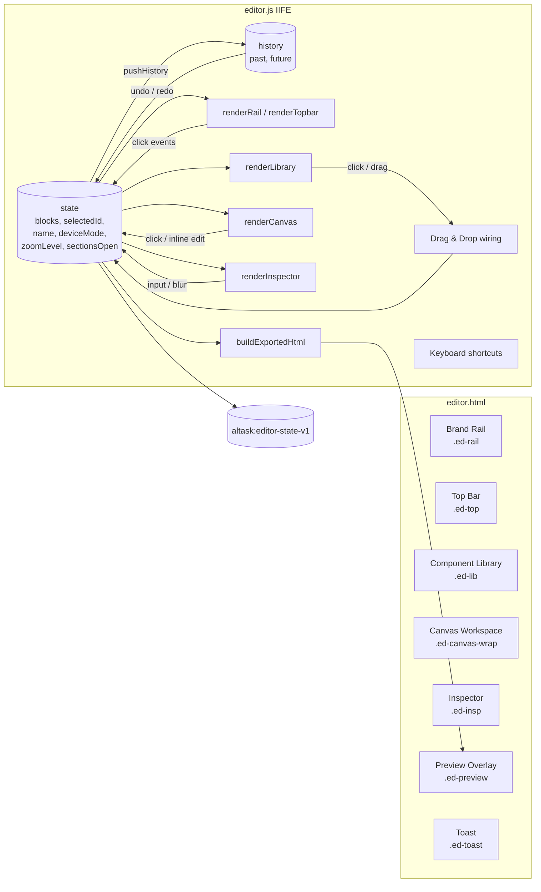
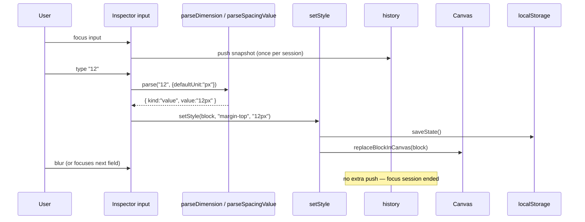

# Design Document

## Overview

This redesign refreshes the chrome and inspector of the Altask visual editor (`editor.html` + `assets/js/editor.js` + `assets/css/editor.css`) to match a Visily‑style reference: a thin left **brand rail**, a **components library** with Layouts/Elements tabs and search, a centred **canvas** with a device toolbar that shows exact pixel width and zoom percentage, and a right **inspector** with alignment tabs and CSS‑style panels (Spacing, Size, Position, Typography, Colors).

The work is intentionally framed as an **evolution** of the current implementation, not a rewrite:

- `editor.html` keeps its role as the entry point, root markup, and asset hub.
- `assets/js/editor.js` keeps its single‑module IIFE structure, its block schema (`{ id, type, props }`), its `localStorage` key (`altask:editor-state-v1`), and its render → state → persist flow.
- `assets/css/editor.css` keeps the existing canvas block styles (`.blk--*`) and the current colour tokens defined in `assets/css/base.css`.

What changes:

1. **Layout** — The current 3‑column grid (`.ed-body`) becomes a 4‑region grid: brand rail + library + canvas + inspector, plus a redesigned topbar.
2. **Component library** — The flat list (`#paletteList`) is replaced by a tabbed, searchable, two‑column thumbnail grid grouped by category, while preserving drag semantics (`text/altask-component` MIME type).
3. **Inspector** — The current named‑field‑per‑component inspector becomes a generic CSS inspector with collapsible sections. Per‑component named fields (e.g., Hero title) remain accessible via a "Content" section so inline editing stays the primary content path. Style values move from ad‑hoc `_padding/_fontSize/_textAlign/_bgColor` keys to a structured `_style.<css-prop>` namespace inside `props`.
4. **Canvas** — The sheet gains an explicit pixel width per device (1440 / 768 / 375), a zoom transform (25 %–200 %), and a top‑centre transform anchor for stable scaling.
5. **Top bar** — Adds a viewport readout (`{WIDTH} PX / {ZOOM}%`), a Publish button (re‑uses the existing preview pipeline), and a project subtitle showing a slugified URL.

The data model, persistence, undo/redo, drag/drop, inline editing, device preview, and export pipelines all remain. The redesign adds layout chrome and inspector controls; it does not introduce a new framework, new module system, or a new state store.

### Non‑goals

- No build step, no framework adoption, no migration to TypeScript.
- No real publish backend — Publish reuses the existing in‑browser preview overlay populated with the export HTML (per Requirement 18.2).
- No multi‑page documents — the Page remains a single ordered list of Blocks.
- No collaborative editing.

---

## Architecture

### High‑level structure



Every user action funnels through the same pipeline: mutate `state` → optionally `pushHistory` → `saveState` → `renderCanvas` / `renderInspector`. Targeted re‑renders (e.g., `replaceBlockInCanvas`) are kept for input fields that must not lose focus during typing.

### Region layout (CSS grid)

```
┌────────────────────────────────────────────────────────────────────┐
│                            .ed-top (60px)                          │
├──────┬──────────────┬───────────────────────────────┬──────────────┤
│      │              │                               │              │
│ rail │ library      │       canvas workspace        │  inspector   │
│ 64px │ 256px        │       (1fr)                   │  280px       │
│      │              │                               │              │
└──────┴──────────────┴───────────────────────────────┴──────────────┘
```

CSS:

```css
.ed-app {
  display: grid;
  grid-template-rows: 60px 1fr;
  grid-template-columns: 64px 256px 1fr 280px;
  grid-template-areas:
    "rail top top top"
    "rail lib canvas insp";
  height: 100vh;
}
.ed-rail   { grid-area: rail; }
.ed-top    { grid-area: top; }
.ed-lib    { grid-area: lib; }
.ed-canvas-wrap { grid-area: canvas; }
.ed-insp   { grid-area: insp; }
```

This uses one grid container instead of nested grids, so the rail can span both rows (Requirement 1.1).

### Responsive behaviour (Requirement 1.7)

At viewport widths below 1024 px:

```css
@media (max-width: 1023px) {
  .ed-app {
    grid-template-columns: 64px 1fr;
    grid-template-areas:
      "rail top"
      "rail canvas";
  }
  .ed-lib, .ed-insp {
    position: fixed;
    top: 60px;
    bottom: 0;
    width: 320px;
    z-index: 30;
    transform: translateX(-100%);
    transition: transform 0.22s var(--ease);
  }
  .ed-lib  { left: 64px; }
  .ed-insp { right: 0; transform: translateX(100%); }
  .ed-lib.is-open  { transform: translateX(0); }
  .ed-insp.is-open { transform: translateX(0); }
}
```

Brand rail buttons (Add / Pages / Settings) toggle these drawers via `aria-expanded` and a state field `state.panelsOpen = { lib: bool, insp: bool }` (not persisted — session only).

### Module structure inside `editor.js`

The single IIFE keeps its current sections; new sections are added in clearly marked regions. The top‑level layout is:

```
editor.js (IIFE)
├─ Constants (STORAGE_KEY, DEVICE_WIDTHS, ZOOM_STEPS, FONT_OPTIONS, INSPECTOR_SECTIONS)
├─ Schema      — COMPONENTS array (extended with `category` + `tab` fields)
├─ State       — load/save/migrate, makeBlock, history
├─ Style model — getStyle / setStyle / clearStyle, parseDimension, formatDimension
├─ Renderers
│   ├─ renderRail       (NEW)
│   ├─ renderTopbar     (refactor of wireTopbar)
│   ├─ renderLibrary    (NEW — replaces renderPalette)
│   ├─ renderCanvas     (extended: device width, zoom transform, selection handles)
│   └─ renderInspector  (rewritten: sections + Spacing/Size/Position/Typography/Colors)
├─ Interaction
│   ├─ wireCanvasDnD    (kept; insertion indicator)
│   ├─ wireKeyboard     (extended: Cmd/Ctrl+D, Esc, Cmd/Ctrl+Wheel zoom)
│   └─ wirePanelToggles (NEW — drawers on small viewports)
├─ Export      — buildExportedHtml, renderForExport (extended to inline _style.* values)
└─ Boot
```

No new files are introduced. The total `editor.js` LOC budget is ~1.6× the current size; CSS doubles roughly to accommodate the new chrome.

---

## Components and Interfaces

### 1. Brand Rail (`.ed-rail`) — Requirement 2

Markup:

```html
<aside class="ed-rail" role="navigation" aria-label="Editor navigation">
  <a class="ed-rail__brand" href="index.html" aria-label="Back to Altask">…</a>
  <nav class="ed-rail__nav">
    <button data-rail="add"      data-tooltip="Add component"  aria-pressed="false">…</button>
    <button data-rail="layers"   data-tooltip="Pages / Layers" aria-pressed="false">…</button>
    <button data-rail="media"    data-tooltip="Media"          aria-pressed="false">…</button>
    <button data-rail="search"   data-tooltip="Search"         aria-pressed="false">…</button>
    <button data-rail="settings" data-tooltip="Settings"       aria-pressed="false">…</button>
  </nav>
  <div class="ed-rail__bottom">
    <button data-rail="help" data-tooltip="Help">…</button>
    <button data-rail="account" data-tooltip="Account">…</button>
  </div>
</aside>
```

| Width  | Active style                              | Tooltip delay | Anchor                     |
|--------|-------------------------------------------|---------------|----------------------------|
| 64 px  | `background: var(--p-50)` + `color: var(--p-700)` + 2 px left bar | 250 ms (CSS) | brand pinned top, help/account `margin-top: auto` |

Tooltips are implemented in pure CSS via `[data-tooltip]::after` and `:hover` (no JS). Delay sits at 250 ms (well under the 300 ms ceiling in 2.5).

Click behaviour:

- `add` → opens the library drawer (mobile) or focuses `#libSearch` (desktop) per 2.4.
- `layers` / `media` / `search` / `settings` → open contextual drawers in future work; for this redesign they are wired to no‑op handlers that toggle the `aria-pressed` state. (Listed in 2.2 as required, behaviour beyond add/search is out of scope.)
- `help` → opens `docs.html` in a new tab.
- `account` → no‑op for now (signed‑out state shown).

### 2. Top Bar (`.ed-top`) — Requirement 3

Three groups: **left** (project meta + brand mark), **centre** (device toggle + viewport readout), **right** (undo/redo + share + preview + Publish + avatar).

```html
<header class="ed-top">
  <div class="ed-top__left">
    <div class="ed-top__title">
      <input id="nameInput" class="ed-top__name"   value="…">
      <span  id="nameSlug"  class="ed-top__slug">https://untitled.altask.dev</span>
    </div>
  </div>

  <div class="ed-top__center">
    <div class="ed-devices" role="tablist">
      <button data-device="desktop" class="is-on" role="tab" aria-selected="true"  title="Desktop (1440)">…</button>
      <button data-device="tablet"             role="tab" aria-selected="false" title="Tablet (768)">…</button>
      <button data-device="mobile"             role="tab" aria-selected="false" title="Mobile (375)">…</button>
    </div>
    <div class="ed-viewport">
      <span id="viewportSize">1440 PX</span>
      <span class="sep">/</span>
      <select id="zoomSelect" aria-label="Zoom">
        <option>25%</option>…<option selected>100%</option>…<option>200%</option>
      </select>
    </div>
  </div>

  <div class="ed-top__right">
    <button id="undoBtn" …>…</button>
    <button id="redoBtn" …>…</button>
    <span class="ed-divider"></span>
    <button id="shareBtn"   class="ed-iconbtn">…</button>
    <button id="previewBtn" class="ed-iconbtn">▶</button>
    <button id="publishBtn" class="btn btn-primary btn-sm">Publish</button>
    <button id="avatarBtn"  class="ed-avatar">TA</button>
  </div>
</header>
```

The viewport readout is computed from a `DEVICE_WIDTHS = { desktop: 1440, tablet: 768, mobile: 375 }` constant (Requirements 5.2, 14.1–14.3). The slug is `state.name.toLowerCase().replace(/[^a-z0-9]+/g, '-').replace(/^-|-$/g, '') || 'untitled'`.

Publish behaviour reuses `openPreview()` so the same preview overlay is shown for both `▶` and `Publish` (Requirements 3.7 and 3.8). The existing Export action remains accessible from a keyboard shortcut (`Cmd/Ctrl+E`) — Export is no longer in the top bar but is still exercised by the export tests.

### 3. Component Library (`.ed-lib`) — Requirement 4

Markup:

```html
<aside class="ed-lib" aria-label="Components">
  <div class="ed-lib__tabs" role="tablist">
    <button class="is-on" data-tab="layouts"  role="tab" aria-selected="true">Layouts</button>
    <button             data-tab="elements" role="tab" aria-selected="false">Elements</button>
  </div>
  <div class="ed-lib__search">
    <svg>…</svg>
    <input id="libSearch" placeholder="Search components…">
  </div>
  <div class="ed-lib__list" id="libList">
    <!-- rendered per category, see template below -->
  </div>
</aside>
```

Per category section:

```html
<section class="ed-lib__cat" data-category="hero">
  <header class="ed-lib__cat-head" aria-expanded="true">
    <svg class="chev">…</svg>
    <h4>Hero</h4>
  </header>
  <div class="ed-lib__grid">
    <article class="ed-lib__card" draggable="true" data-comp="hero">
      <span class="ed-lib__caption">HERO</span>
      <div class="ed-lib__thumb" aria-hidden="true">
        <!-- inline SVG thumbnail of the layout -->
      </div>
    </article>
    …
  </div>
</section>
```

Component classification — extension to the existing `COMPONENTS` array. Each component gets two new fields:

| id        | tab       | category    |
|-----------|-----------|-------------|
| `hero`    | layouts   | Hero        |
| `navbar`  | layouts   | Navigation  |
| `features`| layouts   | Features    |
| `columns` | layouts   | Sections    |
| `cta`     | layouts   | Call to action |
| `quote`   | layouts   | Testimonials |
| `gallery` | layouts   | Media       |
| `form`    | layouts   | Forms       |
| `footer`  | layouts   | Footer      |
| `heading` | elements  | Text        |
| `text`    | elements  | Text        |
| `button`  | elements  | Interactive |
| `image`   | elements  | Media       |
| `divider` | elements  | Layout primitives |
| `spacer`  | elements  | Layout primitives |

This satisfies Requirement 4.13 (every existing component is registered under one tab) without altering component IDs, defaults, or render functions.

**Search filtering** runs on every `input` event with a 60 ms debounce (well within the 100 ms budget in 4.8). Filter predicate:

```js
const q = query.trim().toLowerCase();
const matches = (c) =>
  q === "" ||
  c.label.toLowerCase().includes(q) ||
  c.category.toLowerCase().includes(q);
```

When zero items match, the list area renders the empty‑state element with the literal query (Requirement 4.9).

**Tab change** clears `#libSearch.value` (4.10) and repaints `#libList`.

**Drag & drop** uses the existing `text/altask-component` MIME type (Requirement 4.11) and the existing canvas drop‑zone handler in `wireCanvasDnD`. Cards remain `draggable="true"`.

**Click‑to‑append** keeps the existing `pushHistory → state.blocks.push(makeBlock(id)) → afterStateChange` flow (Requirement 4.12).

### 4. Canvas (`.ed-canvas-wrap` + `.ed-canvas`) — Requirements 5, 6, 7, 14, 15

Outer wrapper handles scrolling and the dotted backdrop; inner `.ed-canvas` is the white sheet.

```html
<div class="ed-canvas-wrap">
  <div class="ed-canvas-stage" style="--zoom:1">
    <div id="canvas" class="ed-canvas" data-device="desktop"></div>
  </div>
</div>
```

Sizing CSS:

```css
.ed-canvas {
  background: #fff;
  box-shadow: 0 30px 80px -30px rgba(15,15,20,.18), 0 1px 2px rgba(15,15,20,.04);
  border: 1px solid var(--border);
  margin: 32px auto;
  transition: width 0.25s var(--ease);
}
.ed-canvas[data-device="desktop"] { width: 1440px; }
.ed-canvas[data-device="tablet"]  { width: 768px;  }
.ed-canvas[data-device="mobile"]  { width: 375px;  }

.ed-canvas-stage {
  transform: scale(var(--zoom, 1));
  transform-origin: top center;
  transition: transform 0.18s var(--ease);
}
```

Device width values (1440 / 768 / 375) match Requirement 5.2 exactly. The 200–300 ms transition (14.4) is achieved via the 250 ms width transition.

Zoom (Requirement 15) is applied as `transform: scale()` on the stage, anchored top‑centre (15.2). The wrapper is `overflow: auto`, so when the scaled width exceeds the viewport the user gets horizontal scroll (5.4). `Ctrl/Cmd + wheel` increments zoom through `ZOOM_STEPS = [0.25, 0.5, 0.6, 0.75, 1, 1.25, 1.5, 2]` (15.4).

**Selection** outlines and handles (Requirement 6):

```css
.ed-block.is-selected { outline: 2px solid var(--p-500); }
.ed-block.is-selected::before,
.ed-block.is-selected::after,
.ed-block.is-selected > .ed-block__h-tl,
.ed-block.is-selected > .ed-block__h-br { /* 4 corner handles */ }
```

Four 8 × 8 px squares are positioned at each corner via a single block bar element with four pseudo‑element children to keep the DOM cost flat.

**Drop indicator** (Requirement 7.1) — keep the existing `.ed-dropline` element and 2.5 px blue border; no behavioural change required.

### 5. Inspector (`.ed-insp`) — Requirements 8–13

The inspector is a vertical scroll container with a sticky header and collapsible sections. Header structure:

```html
<aside class="ed-insp" aria-label="Inspector">
  <header class="ed-insp__head">
    <div class="ed-insp__title">
      <strong id="inspName">Hero</strong>
      <span   id="inspId"  class="ed-insp__id">#b_a1f3c9</span>
    </div>
    <div class="ed-insp__align" role="group" aria-label="Alignment">
      <button data-align="h-left">…</button>
      <button data-align="h-center">…</button>
      <button data-align="h-right">…</button>
      <button data-align="h-justify">…</button>
      <span class="ed-divider"></span>
      <button data-align="v-top">…</button>
      <button data-align="v-middle">…</button>
      <button data-align="v-bottom">…</button>
      <button data-align="distribute">…</button>
    </div>
  </header>

  <div class="ed-insp__body" id="inspBody">
    <!-- Content section (per-component fields, kept) -->
    <section data-section="content"   class="ed-insp__sec is-open">…</section>
    <!-- Generic CSS sections -->
    <section data-section="spacing"    class="ed-insp__sec is-open">…</section>
    <section data-section="size"       class="ed-insp__sec is-open">…</section>
    <section data-section="position"   class="ed-insp__sec">…</section>
    <section data-section="typography" class="ed-insp__sec is-open">…</section>
    <section data-section="colors"     class="ed-insp__sec">…</section>
  </div>
</aside>
```

Section render produces:

```html
<section data-section="spacing" class="ed-insp__sec is-open">
  <header class="ed-insp__sec-head" aria-expanded="true">
    <svg class="chev">…</svg>
    <h5>Spacing</h5>
  </header>
  <div class="ed-insp__sec-body">…</div>
</section>
```

Open/closed state is held in `state.sectionsOpen = { content: true, spacing: true, size: true, position: false, typography: true, colors: false }` (Requirement 8.3). Defaults match 11.1 (Position collapsed) and 13.1 (Colors collapsed). This map is **session‑only** (not persisted), to keep `Persisted_State` minimal.

The alignment toolbar (Requirement 8.5) writes `text-align` (h‑\*) and `vertical-align` / `align-items` (v‑\*) style props.

#### 5.1 Spacing editor — Requirement 9

Two nested rounded rectangles with four numeric inputs each:

```
┌─ MARGIN ─────────────────────────┐
│              [ 0 ]               │
│  ┌─ PADDING ─────────────────┐   │
│  │           [ 16 ]          │   │
│  │ [16]                [16]  │   │
│  │           [ 16 ]          │   │
│  └───────────────────────────┘   │
│ [0]                       [0]    │
│              [ 0 ]               │
└──────────────────────────────────┘
```

Each input is paired with a unit selector that defaults to `px`. The component shape:

```js
function SpacingBox(scope /* "margin" | "padding" */) {
  return {
    sides: ["top", "right", "bottom", "left"],
    inputs: { top: numberInput, right: …, bottom: …, left: … },
    units:  { top: unitSelect, … },
    linkBtn: chainToggle,
  };
}
```

**Input parsing** (Requirement 9.6, 9.7, 9.8):

```js
function parseSpacingValue(raw, scope, side) {
  const trimmed = (raw ?? "").trim();
  if (trimmed === "") return { kind: "clear" };
  if (scope === "margin" && trimmed.toLowerCase() === "auto")
    return { kind: "value", value: "auto" };
  const m = /^(-?\d+(?:\.\d+)?)\s*(px|%|em|rem)?$/.exec(trimmed);
  if (!m) return { kind: "invalid" };
  let n = parseFloat(m[1]);
  const unit = m[2] || "px";
  if (scope === "padding" && n < 0) n = 0;          // 9.8
  return { kind: "value", value: `${n}${unit}` };
}
```

When `parseSpacingValue` returns `{ kind: "invalid" }`, the input is reverted to its prior DOM value and no style mutation occurs (9.7).

**Linked mode** (9.5) lives on each rectangle:

```js
state.spacingLinked = { margin: false, padding: false };  // per-edit, not persisted
```

When linked is on and a side changes, the same parsed value is written to all four sides of that scope.

#### 5.2 Size & Overflow — Requirement 10

```html
<div class="ed-row">
  <label>Width</label>
  <input type="text" data-style="width"  data-kind="dimension">
  <select data-unit="width"><option>px</option><option>%</option><option>vw</option><option>auto</option></select>
</div>
<div class="ed-row">
  <label>Height</label>
  <input type="text" data-style="height" data-kind="dimension">
  <select data-unit="height"><option>px</option><option>%</option><option>vh</option><option>auto</option></select>
</div>
<div class="ed-row ed-row--icons" role="group" aria-label="Overflow">
  <button data-style="overflow" data-value="visible" aria-pressed="true">…</button>
  <button data-style="overflow" data-value="hidden">…</button>
  <button data-style="overflow" data-value="scroll">…</button>
  <button data-style="overflow" data-value="auto">…</button>
</div>
```

The unit dropdown for `Width` contains `px / % / vw / auto`; for `Height` it contains `px / % / vh / auto` (Requirement 10.1). Width and height use the same `parseDimension` helper as Spacing.

#### 5.3 Position — Requirement 11

```html
<div class="ed-row">
  <label>Position</label>
  <select data-style="position">
    <option>static</option><option>relative</option><option>absolute</option>
    <option>fixed</option><option>sticky</option>
  </select>
</div>
<!-- 4 inputs: top/right/bottom/left, each with the same dimension parser -->
```

#### 5.4 Typography — Requirement 12

```html
<div class="ed-row">
  <label>Typeface</label>
  <select data-style="font-family">
    <option value="">System default</option>
    <option value="Inter, system-ui, sans-serif">Inter</option>
    <option value="'Urbanist', sans-serif">Urbanist</option>
    <option value="'Playfair Display', serif">Playfair Display</option>
    <option value="'Manrope', sans-serif">Manrope</option>
    <option value="'JetBrains Mono', ui-monospace, monospace">JetBrains Mono</option>
  </select>
</div>
<div class="ed-row">
  <label>Weight</label>
  <select data-style="font-weight">
    <option>100</option>…<option>900</option>
  </select>
</div>
<div class="ed-row">
  <label>Size</label>
  <input type="text" data-style="font-size" data-kind="dimension">
  <select data-unit="font-size"><option>px</option><option>rem</option><option>em</option></select>
</div>
<div class="ed-row ed-row--icons" role="group" aria-label="Text alignment">
  <button data-style="text-align" data-value="left"   aria-pressed="true">…</button>
  <button data-style="text-align" data-value="center">…</button>
  <button data-style="text-align" data-value="right">…</button>
  <button data-style="text-align" data-value="justify">…</button>
</div>
```

When the user selects `System default` (empty value), `font-family` is **removed** from the block's style props (Requirement 12.7). Non‑empty selections call `setStyle('font-family', value)`.

#### 5.5 Colors — Requirement 13

```html
<div class="ed-row ed-row--color">
  <label>Background</label>
  <input type="color" data-style="background-color" data-color-pair="bgHex">
  <input type="text"  id="bgHex" data-color-text="background-color" placeholder="#ffffff">
</div>
<div class="ed-row ed-row--color">
  <label>Text</label>
  <input type="color" data-style="color" data-color-pair="fgHex">
  <input type="text"  id="fgHex" data-color-text="color" placeholder="#000000">
</div>
```

The hex text input and the native `<input type="color">` are mirrored. Clearing the hex text input (empty value) removes the corresponding `_style.background-color` or `_style.color` key entirely (Requirement 13.5).

### 6. Preview overlay & Publish

Unchanged DOM. Behaviour change: both `#previewBtn` and `#publishBtn` call `openPreview()` (Requirement 3.7, 3.8). `buildExportedHtml()` now walks `_style.*` props (see Data Models) and writes them as inline `style` attributes (Requirement 18.1).

---

## Data Models

### Block (existing, extended)

```ts
type Block = {
  id: string;          // "b_" + 7 random base36 chars
  type: ComponentId;   // "hero" | "heading" | … | "divider"
  props: Record<string, string>;
};
```

`props` keeps **two name spaces**:

1. **Content props** — keys defined per component (`title`, `subtitle`, `links`, …). Unchanged.
2. **Style props** — reserved keys prefixed with `_style.<css-prop>` (Requirement 16.5). Examples:
   - `_style.margin-top`     = `"12px"` | `"auto"` | `""`
   - `_style.padding-left`   = `"24px"`
   - `_style.width`          = `"100%"` | `"auto"`
   - `_style.font-family`    = `"'Urbanist', sans-serif"`
   - `_style.background-color` = `"#eef2fb"`

Reserved key shape: matches `/^_style\.[a-z][a-z0-9-]*$/`.

The legacy keys (`_padding`, `_fontSize`, `_textAlign`, `_bgColor`) are migrated on load:

```js
function migrateLegacyStyles(block) {
  const p = block.props;
  if (p._padding   && !p["_style.padding"])    p["_style.padding"]    = `${p._padding}px`;
  if (p._fontSize  && !p["_style.font-size"])  p["_style.font-size"]  = `${p._fontSize}px`;
  if (p._textAlign && !p["_style.text-align"]) p["_style.text-align"] = p._textAlign;
  if (p._bgColor && p._bgColor !== "#ffffff" && !p["_style.background-color"])
    p["_style.background-color"] = p._bgColor;
  delete p._padding; delete p._fontSize; delete p._textAlign; delete p._bgColor;
  return block;
}
```

This satisfies Requirement 16.4 (existing blocks render) and 16.3 (missing fields tolerated).

### Page state

```ts
type EditorState = {
  blocks:     Block[];
  selectedId: string | null;
  name:       string;        // "Untitled site" by default
  deviceMode: "desktop" | "tablet" | "mobile";   // NEW, persisted (Req 14.6)
  zoomLevel:  number;        // 0.25..2.0, NEW, persisted (Req 15.5)
};
```

Persistence key remains `altask:editor-state-v1` (Requirement 16.1). `deviceMode` and `zoomLevel` are added; missing fields are treated as `desktop` and `1` (Requirement 16.3).

Session‑only (not in `localStorage`):

```ts
type SessionState = {
  panelsOpen:   { lib: boolean; insp: boolean };  // mobile drawer toggles
  sectionsOpen: Record<InspectorSection, boolean>;
  spacingLinked:{ margin: boolean; padding: boolean };
  activeTab:    "layouts" | "elements";
  librarySearch:string;
};
```

### Style helper API

A small style accessor module sits between renderers and `block.props`:

```js
const STYLE_PREFIX = "_style.";

function getStyle(block, prop) {
  return block.props[STYLE_PREFIX + prop];   // string | undefined
}

function setStyle(block, prop, value) {
  if (value == null || value === "") {
    delete block.props[STYLE_PREFIX + prop];
  } else {
    block.props[STYLE_PREFIX + prop] = String(value);
  }
}

function listStyles(block) {
  const out = {};
  for (const k of Object.keys(block.props)) {
    if (k.startsWith(STYLE_PREFIX)) out[k.slice(STYLE_PREFIX.length)] = block.props[k];
  }
  return out;
}

function applyStylesTo(node, block) {
  const styles = listStyles(block);
  for (const [prop, val] of Object.entries(styles)) {
    if (val === "") node.style.removeProperty(prop);
    else            node.style.setProperty(prop, val);
  }
}
```

### Dimension parsing

```js
const UNIT_RE = /^(-?\d+(?:\.\d+)?)(px|%|em|rem|vw|vh)?$/i;

function parseDimension(raw, opts = {}) {
  const t = (raw ?? "").trim();
  if (t === "")                return { kind: "clear" };
  if (opts.allowAuto && /^auto$/i.test(t)) return { kind: "value", value: "auto" };
  const m = UNIT_RE.exec(t);
  if (!m)                      return { kind: "invalid" };
  let n = parseFloat(m[1]);
  const unit = m[2] ? m[2].toLowerCase() : (opts.defaultUnit || "px");
  if (opts.minZero && n < 0)   n = 0;
  return { kind: "value", value: `${n}${unit}` };
}

function formatDimension(stored) {
  if (!stored)       return { number: "", unit: "px" };
  if (stored === "auto") return { number: "auto", unit: "auto" };
  const m = UNIT_RE.exec(stored);
  if (!m)            return { number: stored, unit: "px" };
  return { number: m[1], unit: (m[2] || "px").toLowerCase() };
}
```

`parseDimension` is the single chokepoint for all numeric style inputs (margin / padding / width / height / font‑size / position offsets), which makes it the natural focus of property tests.

### History

`history.past` and `history.future` keep storing **JSON snapshots of the entire `state` object**. The 80‑entry cap (Requirement 17.4) is preserved. Push / pop semantics are unchanged.

---

## Mermaid: edit pipeline for an inspector change



If parse returns `{ kind: "invalid" }`, the arrow from I to S is skipped and the input is reverted to the prior value (Requirement 9.7).

---

<!-- Correctness Properties section will be inserted here after prework -->
